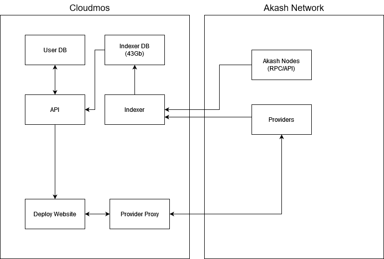

<div align="left">
  
  <a href="https://aimeos.org/">
    
</a>
  
  # Cloudmos
 
**Cloudmos** is an app that let's you deploy any [docker container](https://www.docker.com/) on the [Akash Network](https://akash.network) in a few clicks... 🛠
  


[](https://twitter.com/cloudmosio)
[](https://discord.gg/akash)
  
</div>

- [Services](#services)
- [Monitoring](#monitoring)
- [Example SQL Queries](#example-sql-queries)
- [How to run](#how-to-run)
- [Database Structure](#database-structure)

# Services

## Dataflow between services



Every services are nodejs applications written in typescript. They are deployed using docker. Both databases are PostgreSQL deployed on GCP.

## Deploy Website

Website to deploy on Akash. It is using the Next.js framework. The data shown in the website comes from a combination of our [API](#api) and akash nodes (REST).

Url: [deploy.cloudmos.io](https://deploy.cloudmos.io)  
Directory: [deploy-web](/deploy-web/)

## Provider Proxy

Used in the deploy website to proxy requests to providers. Needed since it's not possible to use the cert authentication system from the browser.

This is the equivalent of the [Proxy](https://github.com/akash-network/console/tree/main/proxy) used by the akash console.

Directory: [provider-proxy](/provider-proxy/)

## API

Provides data to the deploy website. The data is fetched from our Indexer database + coingecko for market data. This api also provide the endpoint for the [Web3 Index](https://web3index.org/) integration.  

Url: [api.cloudmos.io](https://api.cloudmos.io)  
Directory: [api](/api/)

## Indexer

Fetch the latest blocks from RPC nodes. Saves the blocks & stats to our Indexer Database. For details on how the indexer work see the [Indexer README](./indexer/README.md)  

Directory: [indexer](/indexer/)

## Landing Page

Small landing page with button to "Launch App".

Url: [cloudmos.io](https://cloudmos.io/)  
Directory: [landing](/landing/)

## Config

Directory containing public config file that are fetch by the deploy tool. This is to allow modifying some configurations on the spot without the need to redeploy the web interface.

Directory: [config](/config/)

# Monitoring
- [Sentry.io](https://sentry.io/) is integrated into all our services and allows us to catch js exceptions in the frontend as well as backend.
- [HealthChecks.io](https://healthchecks.io) is used to monitor the execution of our [Scheduled Tasks](./indexer/README.md#scheduled-tasks). If a task is failing we get an email + alert in discord.
- [Cronitor](https://cronitor.io) is used to monitor uptime. If our website or apis goes offline we get an email + alert in discord.
- [Grafana](https://grafana.net) dashboards allows us to see usage stats and syncing status. We can monitor block syncing and scheduled task there.
- **Status Endpoints**  
  All our backend services have `/status` endpoints built into them allowing us to monitor health and view usage stats. Those endpoints are use by the other monitoring tools.
  
# Example SQL Queries

See [Example_Queries.md](./doc/Example_Queries.md)

# Running the Application

This document provides instructions on how to set up and run the application, including steps for manual database restoration and using Docker Compose for ease of setup.

## Manual Database Restoration

Due to the extensive time required to index Akash from block #1, it's recommended to initialize your database using an existing backup for efficiency. This approach is particularly beneficial for development purposes.

### Available Backups

- **Mainnet Database (~30 GB):** [cloudmos-akash-mainnet.sql.gz](https://storage.googleapis.com/cloudmos-postgresql-backups/cloudmos-akash-mainnet.sql)
  - Suitable for scenarios requiring complete data.
- **Sandbox Database (< 300 MB):** [cloudmos-akash-sandbox.sql.gz](https://storage.googleapis.com/cloudmos-postgresql-backups/cloudmos-akash-sandbox.sql.gz)
  - Ideal for most development needs, although it may lack recent chain updates.

### Restoration Steps

1. Create a PostgreSQL database.
2. Restore the database using `psql`. Ensure PostgreSQL tools are installed on your system.

For a .sql.gz file:
```sh
gunzip -c /path/to/cloudmos-akash-sandbox.sql.gz | psql --host "localhost" --port "5432" --username "postgres" --dbname "cloudmos-akash"
```
After restoring the database, you can proceed with the specific project's README instructions for further setup and running the application.

### Using Docker Compose
For convenience, a Docker Compose configuration is provided to automate the database setup, download, and data import process.

#### Configuration
1. Ensure environment variables are set in .postgres.local.env. This file configures PostgreSQL and import settings.
2. The `POSTGRES_DBS_FOR_IMPORT` variable should be updated with the databases you wish to import. This is a comma-separated list with potential values including `cloudmos-akash-sandbox` (default) and `cloudmos-akash-2` (mainnet). Leave this variable empty if no import is desired.

#### Running Docker Compose
```sh
docker-compose up db
```
This command spins up the database service and automatically handles the downloading and importing of the specified data.

# Database Structure

The database schemas is defined using [sequelize-typescript](https://github.com/sequelize/sequelize-typescript) in [/shared/dbSchemas/](./shared/dbSchemas/). Models are separated into the following folders:

- **base** - Tables which are cosmos generic and are used for every chains
- **akash** - Tables which are akash specific (they are not created when initializing a database for another chain)
- **user** - Tables which are user specific. Contains tables for user settings and templates

## Block
|Column|Type|Note|
|-|-|-
|height|integer
|datetime|timestamp
|hash|varchar
|proposer|varchar
|dayId|uuid|See [Day](#day)
|txCount|integer
|isProcessed|boolean|`false` when inserted into the database and then set to `true` once the indexers have processed every messages in the block.
|totalTxCount|bigint| Global tx count as of this height (for historical tx count graphs).
|totalUAktSpent|double|Cummulative uakt spent on deployments as of this block. ||[Graph](https://deploy.cloudmos.io/graph/total-akt-spent)
|activeLeaseCount|integer|Currently active lease count as of this block. [Graph](https://deploy.cloudmos.io/graph/active-deployment)
|totalLeaseCount|integer|Cummulative lease count as of this block. [Graph](https://deploy.cloudmos.io/graph/all-time-deployment-count)
|activeCPU|integer|Currently leased CPU as of this block. [Graph](https://deploy.cloudmos.io/graph/compute)
|activeMemory|bigint|Currently leased Memory as of this block. [Graph](https://deploy.cloudmos.io/graph/memory)
|activeEphemeralStorage|bigint|Currently leased Ephemeral Storage as of this block. [Graph](https://deploy.cloudmos.io/graph/storage)
|activePersistentStorage|bigint|Currently leased Persistent Storage as of this block. [Graph](https://deploy.cloudmos.io/graph/storage)
|activeProviderCount|integer|Provider count as of this block. This only consider on-chain data and does not include uptime checks.

## Transaction

|Column|Type|Note|
|-|-|-
|id|uuid|
|hash|varchar
|height|integer
|msgCount|integer
|multisigThreshold|integer
|gasUsed|integer
|gasWanted|integer
|fee|bigint
|memo|text
|isProcessed|boolean|`false` when inserted into the database and then set to `true` once the indexers have processed every messages in the transaction.
|hasProcessingError|boolean|Indicates if the tx was a success or failed
|log|text|Contains the error message if the tx failed

## Message

|Column|Type|Note|
|-|-|-
|id|uuid
|txId|uuid|See [Transaction](#transaction)
|height|integer|
|type|varchar|ex: `/cosmos.bank.v1beta1.MsgSend`
|typeCategory|varchar|First part of the message part. ex: `cosmos` or `akash`
|index|integer|
|indexInBlock|integer
|isProcessed|boolean|`false` when inserted into the database and then set to `true` once the indexers have processed the message.
|isNotificationProcessed|boolean|`false` when inserted into the database and then set to true once it has been checked for existing alerts. (BlockSpy specific)
|amount|bigint|Amount of the transfer if token were transferred. ex: `MsgSend` or `MsgDelegate`
|data|bytes|Protobuf encoded data of the message
|relatedDeploymentId|uuid|If the message is deployment related (ex: `MsgCloseLease`) this will be set to the related deployment. See [Deployment](#deployment)

## AddressReference

Keeps track of which addresses are involved in which txs (even if they are not the signer).

|Column|Type|Note|
|-|-|-
|id|number|
|transactionId|uuid|See [Transaction](#transaction)
|messageId|uuid|See [Message](#message)
|address|varchar
|type|varchar|Signer/Sender/Receiver

## Day

Created for each days (UTC based), simplifies querying for daily stats.

|Column|Type|Note|
|-|-|-
|id|uuid
|date|timestamp
|aktPrice|double|See the "Sync Price History" task in [Scheduled Tasks](./indexer/README.md#scheduled-tasks).
|firstBlockHeight|integer|First block of the day.
|lastBlockHeight|integer|Last block of the day. `null` if the day has not ended.
|lastBlockHeightYet|integer|Last block of the day as of now.

## Validator

|Column|Type|Note|
|-|-|-
|id|uuid|
|operatorAddress|varchar
|accountAddress|varchar
|hexAddress|varchar
|createdMsgId|uuid|Message which created the validator (`MsgCreateValidator`). See [Message](#message)
|moniker|varchar
|identity|varchar
|website|varchar
|description|text
|securityContact|varchar
|rate|double|
|double|maxRate
|maxChangeRate|double
|minSelfDelegation|bigint
|keybaseUsername|varchar
|keybaseAvatarUrl|varchar

## Deployment

|Column|Type|Note|
|-|-|-
|id|uuid
|owner|varchar|Address of the wallet that owns this deployment
|dseq|varchar
|createdHeight|integer|Height of the `MsgCreateDeployment` message
|balance|double|Remaining balance based on deposits and `MsgWithdrawLease`
|deposit|bigint|Deposited amount based on `MsgCreateDeployment` and `MsgDepositDeployment`
|lastWithdrawHeight|integer|Last height where an account settlement occured. This happens on create, withdraw and close.
|withdrawnAmount|double|Withdrawn amount as of now. Updated on account settlement (create,withdraw,close).
|closedHeight|integer|Height the deployment got closed on-chain. Can happen from `MsgCloseDeployment` or as a side-effect of having no active leases remaining.

## DeploymentGroup

|Column|Type|Note|
|-|-|-
|id|uuid
|deploymentId|uuid|See [Deployment](#deployment)
|owner|varchar|Address of the wallet that owns this deployment group.
|dseq|varchar|
|gseq|integer|

## DeploymentGroupResource

|Column|Type|Note|
|-|-|-
|id|integer
|deploymentGroupId|uuid|See [DeploymentGroup](#deploymentgroup)
|cpuUnits|integer|Thousandth of CPU
|memoryQuantity|bigint|Memory in bytes
|ephemeralStorageQuantity|bigint|Ephemeral Storage in bytes
|persistentStorageQuantity|bigint|Persistent Storage in bytes
|count|integer|
|price|double|

## Lease

|Column|Type|Note|
|-|-|-
|id|uuid
|deploymentId|uuid|See [Deployment](#deployment)
|deploymentGroupId|uuid|See [DeploymentGroup](#deploymentgroup)
|owner|varchar|Address of the wallet that owns this deployment group.
|dseq|varchar
|oseq|integer
|gseq|integer
|providerAddress|varchar
|createdHeight|integer|Height of the lease creation. Happens when a bid is accepted with `MsgCreateLease`.
|closedHeight|integer|Height at which the lease is closed on-chain. Happens from `MsgCloseLease`, `MsgCloseHeight` or if the deployment become overdrawn during an account settlement. 
|predictedClosedHeight|bigint|Height at which the lease should theoritically expire. This is calculated based on the balance and price. It will usually not match the `closedHeight` since leases can be closed early (`MsgCloseLease` & `MsgCloseBid`) or closed late since the closing wont happen until the provider does a `MsgWithdrawLease`
|price|double|Lease price as uakt/block
|withdrawnAmount|double|Withdrawn amount as of now for this lease. Updated on account settlement (create,withdraw,close).
|cpuUnits|integer|Thousandth of CPU
|memoryQuantity|bigint|Memory in bytes
|ephemeralStorageQuantity|bigint|Ephemeral Storage in bytes
|persistentStorageQuantity|bigint|Persistent Storage in bytes

## Bid

|Column|Type|Note|
|-|-|-
|id|integer|
|owner|varchar|Deployment's wallet address
|dseq|varchar
|gseq|integer
|oseq|integer
|provider|varchar|Provider's wallet address
|price|double|Price in uakt/block
|createdHeight|integer|Height of the `MsgCreateBid`

## Provider

|Column|Type|Note|
|-|-|-
|owner|varchar|Address of the wallet that owns this provider
|hostUri|varchar|ex: `https://provider.europlots.com:8443`
|createdHeight|integer|Height at which the provider is created on-chain. (`MsgCreateProvider`)
|updatedHeight|integer|Height at which the provider was last updated. (`MsgUpdateProvider`)
|deletedHeight|integer|Height at which the provider is deleted on-chain. (`MsgDeleteProvider`)
|email|varchar
|website|varchar
|isOnline|boolean|Indicates if the latest uptime check was successful
|lastCheckDate|timestamp|Date & Time of the latest uptime check
|lastSnapshotId|uuid|ID of the last snapshot taken
|nextCheckDate|timestamp|Planned Date & Time of the next uptime check
|failedCheckCount|integer|Amount of consecutive failed checks, `NULL` if currently online.
|lastSuccessfulSnapshotId|uuid|Snapshot ID of the last successful check
|downtimeFirstSnapshotId|uuid|Snapshot ID of the first failed check of the current downtime period. `NULL` if currently online.
|error|text|`NULL` if the latest uptime check was successful, otherwise this wil contain the error message.
|deploymentCount|integer
|leaseCount|integer
|activeCPU|bigint|Thousandth of CPU
|activeMemory|bigint|Memory in bytes
|activeStorage|bigint|Storage in bytes
|pendingCPU|bigint|Thousandth of CPU
|pendingMemory|bigint|Memory in bytes
|pendingStorage|bigint|Storage in bytes
|availableCPU|bigint|Thousandth of CPU
|availableMemory|bigint|Memory in bytes
|availableStorage|bigint|Storage in bytes
|akashVersion|varchar
|cosmosSdkVersion|varchar
|ip|varchar|IP obtained by resolving DNS for the `hostUri`
|ipRegion|varchar
|ipCountry|varchar
|ipLat|varchar
|ipLon|varchar
|ipRegionCode|varchar
|ipCountryCode|varchar

## ProviderAttribute

|Column|Type|Note|
|-|-|-
|id|integer|
|provider|varchar|Provider's wallet address
|key|varchar
|value|varchar

## ProviderAttributeSignature

Store audited attributes based on `MsgSignProviderAttributes` & `MsgDeleteProviderAttributes`.

|Column|Type|Note|
|-|-|-
|id|integer|
|provider|varchar|Provider's wallet address
|auditor|varchar|Auditor's wallet address
|key|varchar|
|value|varchar

## ProviderSnapshot

Similar to stats on the [Provider](#provider), but a new row is inserted for every uptime checks. This allows to graph the changes in resources over time as well as calculate an uptime percentage over a period.

|Column|Type|Note|
|-|-|-
|id|uuid|
|owner|varchar|Address of the wallet that owns this provider
|isOnline|boolean|Indicates if this uptime check was successful
|isLastOfDay|boolean|Indicates if this is the last snapshot of the day for this provider
|checkDate|timestamp|Date & Time of this uptime check
|error|text|`null` if the uptime check was successful, otherwise this wil contain the error message.
|deploymentCount|integer
|leaseCount|integer
|activeCPU|bigint|Thousandth of CPU
|activeMemory|bigint|Memory in bytes
|activeStorage|bigint|Storage in bytes
|pendingCPU|bigint|Thousandth of CPU
|pendingMemory|bigint|Memory in bytes
|pendingStorage|bigint|Storage in bytes
|availableCPU|bigint|Thousandth of CPU
|availableMemory|bigint|Memory in bytes
|availableStorage|bigint|Storage in bytes

## ProviderSnapshotNodes

Keep track of ressources of individual provider nodes obtained through feature discovery.

|Column|Type|Note|
|-|-|-
|id|uuid
|snapshotId|uuid|Snapshot ID
|name|varchar|Name of the node
|cpuAllocatable|bigint|Thousandth of CPU
|cpuAllocated|bigint|Thousandth of CPU
|memoryAllocatable|bigint|Memory in bytes
|memoryAllocated|bigint|Memory in bytes
|ephemeralStorageAllocatable|bigint|Storage in bytes
ephemeralStorageAllocated|bigint|Storage in bytes
|capabilitiesStorageHDD|boolean|Indicates if the node supports HDD storage
|capabilitiesStorageSSD|boolean|Indicates if the node supports SSD storage
|capabilitiesStorageNVME|boolean|Indicates if the node supports NVME storage
|gpuAllocatable|bigint
|gpuAllocated|bigint

## ProviderSnapshotNodeCPU

Store CPU informations for each [Provider Nodes](#providersnapshotnodes)

|Column|Type|Note
|-|-|-
|id|uuid
|snapshotNodeId|uuid|Snapshot node ID
|vendor|varchar|ex: `GenuineIntel`
|model|varchar|ex: `Intel(R) Xeon(R) CPU @ 2.30GHz`
|vcores|smallint|

## ProviderSnapshotNodeGPU

Store GPU informations for each [Provider Nodes](#providersnapshotnodes)

|Column|Type|Note
|-|-|-
|id|uuid
|snapshotNodeId|uuid|Snapshot node ID
|vendor|varchar|ex: `nvidia`
|name|varchar|Model name (ex: `rtx4090`)
|modelId|varchar|On the provider, this gets mapped to vendor, name, interface and memorySize based on [this file](https://github.com/akash-network/provider-configs/blob/main/devices/pcie/gpus.json).
|interface|varchar|ex: `PCIe`
|memorySize|varchar|ex: `24Gi`

## Template

|Column|Type|Note|
|-|-|-
|id|uuid|
|userId|uuid|See [User](#user)
|copiedFromId|uuid|If the template was created by using the copy feature, this will contain the `id` of the original template.
|title|varchar
|description|text
|isPublic|boolean
|cpu|bigint
|ram|bigint
|storage|bigint
|sdl|text|
|createdOn|timestamp

## TemplateFavorite

Created when a user "favorite" a template

|Column|Type|Note|
|-|-|-
|id|uuid
|userId|uuid|See [User](#user)
|templateId|uuid|See [Template](#template)
|addedDate|datetime

## UserSetting

|Column|Type|Note|
|-|-|-
|id|uuid
|userId|varchar|User ID given by [Auth0](https://auth0.com) this is the field other tables reference to.
|username|varchar
|email|varchar
|emailVerified|boolean|
|stripeCustomerId|varchar|Created once the user visits the checkout page
|bio|text
|subscribedToNewsletter|boolean
|youtubeUsername|varchar
|twitterUsername|varchar
|githubUsername|varchar
