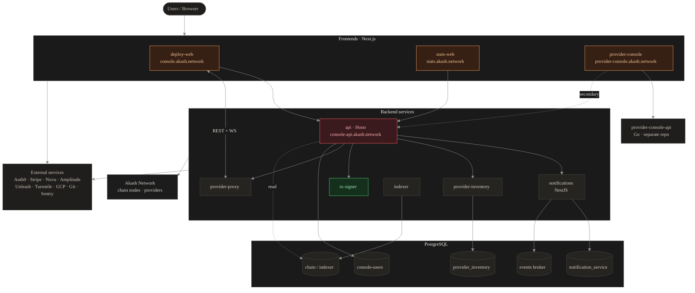

<div align="left">

  <a href="https://console.akash.network">
    
  </a>

  # Akash Console

**Akash Console** is a powerful application that allows you to deploy any [Docker container](https://www.docker.com/) on the [Akash Network](https://akash.network) with just a few clicks. 🚀

> Looking for self-custody (Keplr / your own wallet)? See [Akash Console Air](https://github.com/akash-network/console-air). This repository powers the managed Console at [console.akash.network](https://console.akash.network).

For an in-depth understanding of the code: [](https://deepwiki.com/akash-network/console)

[](https://github.com/akash-network/console/releases)
[](https://github.com/akash-network/console/stargazers)
[](https://github.com/akash-network/console/forks)
[](https://github.com/akash-network/console/blob/main/LICENSE)
[](https://x.com/akashnet)
[](https://discord.gg/akash)

</div>

## Table of Contents

- [Quick Start](#quick-start)
- [Architecture](#architecture)
- [Applications](#applications)
- [Databases](#databases)
- [Managed wallet API](#managed-wallet-api)
- [Running the Application](#running-the-application)
- [Manual Database Restoration](#manual-database-restoration)
- [Shared Packages](#shared-packages)
- [Contributing](#contributing)
- [License](#license)

Further reading: [Architecture deep dive](./doc/architecture.md) · [Apps Configuration](./doc/apps-configuration.md) · [Auth](./doc/auth.md) · [Database Structure](./doc/database-structure.md) · [Release Workflow](./doc/release-workflow.md)

## Quick Start

To get started with Akash Console, follow these steps:

```bash
git clone git@github.com:akash-network/console.git ./akash-console
cd akash-console && npm install
cp -n apps/deploy-web/.env.local.sample apps/deploy-web/.env.local
cp -n apps/api/env/.env.local.sample apps/api/env/.env.local
npm run dc:up:dev -- deploy-web
```

This will start the deploy-web service in development mode with all the necessary dependencies (API, indexer, PostgreSQL). It will also import a backup of the sandbox database by default to speed up the process.

## Architecture

Akash Console is a monorepo (npm workspaces) of three frontends, six backend services, and a set of shared packages. Frontends are Next.js; backend services use Hono or NestJS. Data is served from our own PostgreSQL databases (populated by the indexer) and from the Akash chain and providers. All services are written in TypeScript and shipped as Docker images.


```mermaid
%%{init: {'theme':'base','themeVariables':{'fontFamily':'Geist, Inter, system-ui, sans-serif','fontSize':'14px','background':'#171717','primaryColor':'#242422','primaryTextColor':'#e7e3da','primaryBorderColor':'#45423c','lineColor':'#8f8f8f','textColor':'#d9d5cd','clusterBkg':'#1a1a1a','clusterBorder':'#3a3a3a','titleColor':'#f5f2ec','edgeLabelBackground':'#1a1a1a'},'flowchart':{'curve':'basis','nodeSpacing':45,'rankSpacing':60}}}%%
flowchart TB
  classDef primary fill:#3a1a1d,stroke:#ff5a63,color:#ffb3b7;
  classDef frontend fill:#362013,stroke:#ef9a5c,color:#f3c39a;
  classDef svc fill:#262421,stroke:#47433c,color:#d9d3c8;
  classDef signer fill:#14301c,stroke:#4fce74,color:#a7ecbb;
  classDef chain fill:#1c1c1c,stroke:#5a5650,color:#d9d5cd;
  classDef env fill:#201e1c,stroke:#45423c,color:#cfc9be;

  U(["Users / Browser"]):::env

  subgraph fe["Frontends · Next.js"]
    DW["deploy-web<br/>console.akash.network"]:::frontend
    SW["stats-web<br/>stats.akash.network"]:::frontend
    PC["provider-console<br/>provider-console.akash.network"]:::frontend
  end

  subgraph backend["Backend services"]
    API["api · Hono<br/>console-api.akash.network"]:::primary
    NTF["notifications<br/>NestJS"]:::svc
    PI["provider-inventory"]:::svc
    TXS["tx-signer"]:::signer
    PP["provider-proxy"]:::svc
    IDX["indexer"]:::svc
  end

  subgraph data["PostgreSQL"]
    USERDB[("console-users")]:::svc
    CHAINDB[("chain / indexer")]:::svc
    NTFDB[("notification_service")]:::svc
    EVTDB[("events broker")]:::svc
    PIDB[("provider_inventory")]:::svc
  end

  AKASH["Akash Network<br/>chain nodes · providers"]:::chain
  EXT["External services<br/>Auth0 · Stripe · Novu · Amplitude<br/>Unleash · Turnstile · GCP · Git · Sentry"]:::env
  GOAPI["provider-console-api<br/>Go · separate repo"]:::env

  U --> fe
  DW --> API
  DW <-->|"REST + WS"| PP
  SW --> API
  PC --> GOAPI
  PC -.->|"secondary"| API

  API --> NTF & PI & TXS & PP
  API --> USERDB
  API -.->|"read"| CHAINDB
  IDX --> CHAINDB
  NTF --> NTFDB & EVTDB
  PI --> PIDB

  backend --> AKASH
  fe --> EXT
  backend --> EXT
```

See the [Architecture deep dive](./doc/architecture.md) for per-component detail, data flow, the indexer pipeline, external integrations, and deployment topology.

## Applications

All services are Node.js applications written in TypeScript and deployed using Docker.

| App | Role | Stack | URL |
|---|---|---|---|
| [deploy-web](./apps/deploy-web) | Main deploy UI: build SDLs, deploy, and manage deployments | Next.js | [console.akash.network](https://console.akash.network) |
| [stats-web](./apps/stats-web) | Public network-statistics site | Next.js | [stats.akash.network](https://stats.akash.network) |
| [provider-console](./apps/provider-console) | UI to create and manage an Akash provider (backend is a separate Go repo) | Next.js | [provider-console.akash.network](https://provider-console.akash.network) |
| [api](./apps/api) | Central REST/OpenAPI backend and background jobs | Hono + tsyringe | [console-api.akash.network](https://console-api.akash.network/v1/swagger) |
| [indexer](./apps/indexer) | Downloads Akash chain blocks and indexes them into the chain DB | Node + Sequelize | internal |
| [notifications](./apps/notifications) | Listens to chain events, evaluates alerts, sends email | NestJS + pg-boss | internal (via api) |
| [provider-proxy](./apps/provider-proxy) | Bridges browser requests to providers (mTLS REST + WebSocket) | Hono + ws | [console-provider-proxy.akash.network](https://console-provider-proxy.akash.network) |
| [provider-inventory](./apps/provider-inventory) | Tracks provider capacity for bid screening | Hono + tsyringe | internal (via api) |
| [tx-signer](./apps/tx-signer) | Signs and broadcasts managed-wallet transactions | Hono + tsyringe | internal |
| [log-collector](./apps/log-collector) | Forwards pod logs and K8s events to Datadog (runs on provider clusters) | Node + Fluent Bit | deployed on Akash |

## Databases

All databases are PostgreSQL. The platform uses five logical databases:

- **`console-users`** - user, billing, and auth data owned by `api` (also hosts the pg-boss job queue).
- **`console-akash-sandbox`** - on-chain data written by the `indexer` and read by `api` (the "chain" / "indexer" DB).
- **`notification_service`** - the `notifications` service's own data.
- **`events`** - the `notifications` pg-boss message broker.
- **`provider_inventory`** - provider capacity for bid screening.

There is no Redis: background jobs and the event broker both run on [pg-boss](https://github.com/timgit/pg-boss). The indexer also keeps an on-disk LevelDB block cache during syncing. See [database-structure.md](./doc/database-structure.md) and the [Architecture deep dive](./doc/architecture.md#data-stores) for detail.

## Managed wallet API

- Refer to the [wiki](https://github.com/akash-network/console/wiki/Managed-wallet-API) to manage deployments with the Akash Console API.

## Running the Application

This project's services are deployed using Docker and Docker Compose. All Dockerfiles use multi-stage builds to optimize the build process; the same files build both development and production images.

### Using Docker and Docker Compose

The compose files live in [`packages/docker`](./packages/docker) and are merged by the `dc` wrapper ([`packages/docker/script/dc.sh`](./packages/docker/script/dc.sh)):

- **`docker-compose.build.yml`** - image and build definitions for every service.
- **`docker-compose.runtime.yml`** - runtime config: `restart`, `env_file`, ports, and `depends_on`.
- **`docker-compose.prod-with-db.yml`** - adds the PostgreSQL `db` service and its data volume.
- **`docker-compose.dev.yml`** - development overrides: hot-reload bind mounts and a mock OAuth server.

Some commands are added to `package.json` for convenience:

```shell
npm run dc:build  # Build the production images
npm run dc:up:dev # Run the services in development mode
npm run dc:down   # Stop the services
```

Note: you may pass any `docker compose` argument to the above commands. For example, to only start the `deploy-web` service (and its dependencies) in development mode:

```shell
npm run dc:up:dev -- deploy-web
```

Pass `--no-db` to drop the bundled PostgreSQL service if you already run Postgres yourself.

### Using Turbo Repo

Another way to run apps in dev mode is the Turbo setup. Some available commands are:

```shell
npm run console:dev # run the console UI with its backend (api, provider-proxy, notifications, tx-signer)
npm run stats:dev   # run stats UI in dev mode with dependencies
npm run api:dev     # run api in dev mode with dependencies
npm run indexer:dev # run indexer in dev mode with dependencies
```

The commands above still use Docker to run the PostgreSQL database. To run them without the containerized DB, use the `:no-db` variants:

```shell
npm run console:dev:no-db # console UI with dependencies, no PostgreSQL in Docker
npm run stats:dev:no-db   # stats UI with dependencies, no PostgreSQL in Docker
```

## Manual Database Restoration

Due to the extensive time required to index Akash from block #1, it's recommended to initialize your database using an existing backup for efficiency. This approach is particularly beneficial for development purposes.

### Available Backups

- **Mainnet Database (~30 GB):** [console-akash-mainnet.sql.gz](https://storage.googleapis.com/console-postgresql-backups/console-akash-mainnet.sql.gz)
  - Suitable for scenarios requiring complete data.
- **Sandbox Database (< 300 MB):** [console-akash-sandbox.sql.gz](https://storage.googleapis.com/console-postgresql-backups/console-akash-sandbox.sql.gz)
  - Ideal for most development needs, although it may lack recent chain updates.

### Restoration Steps

1. Create a PostgreSQL database.
2. Restore the database using `psql`. Ensure PostgreSQL tools are installed on your system.

For a .sql.gz file:

```sh
gunzip -c /path/to/console-akash-sandbox.sql.gz | psql --host "localhost" --port "5432" --username "postgres" --dbname "console-akash"
```

After restoring the database, you can proceed with the specific project's README instructions for further setup and running the application.

## Shared Packages

Reusable packages under [`packages/`](./packages) are shared across applications to promote code reuse, maintainability, and consistency.

**Runtime libraries**

- [`database`](./packages/database) - shared Drizzle schemas and DB code (chain + app).
- [`net`](./packages/net) - blockchain network configuration.
- [`http-sdk`](./packages/http-sdk) - shared HTTP client layer.
- [`logging`](./packages/logging) - Pino-based `LoggerService`.
- [`instrumentation`](./packages/instrumentation) - OpenTelemetry setup.
- [`env-loader`](./packages/env-loader) - environment variable loading.
- [`network-store`](./packages/network-store) - browser storage abstraction.
- [`react-query-proxy`](./packages/react-query-proxy) - wraps async services into typed React Query hooks.
- [`openapi-sdk`](./packages/openapi-sdk) - typed, codegen-free OpenAPI fetch client runtime.
- [`console-api-types`](./packages/console-api-types) - generated OpenAPI types and operations table for the API.

**UI**

- [`ui`](./packages/ui) - shared React component library (MUI + Tailwind).

**Dev / build tooling**

- [`dev-config`](./packages/dev-config) - shared ESLint, Prettier, and TypeScript configs.
- [`docker`](./packages/docker) - Dockerfiles, compose files, and the `dc` / `build` scripts.
- [`releaser`](./packages/releaser) - release and versioning helpers.

## Contributing

If you'd like to contribute to the development of Akash Console, please refer to the guidelines outlined in the [CONTRIBUTING.md](./CONTRIBUTING.md) file.

## License

This project is licensed under the [Apache License 2.0](./LICENSE).
