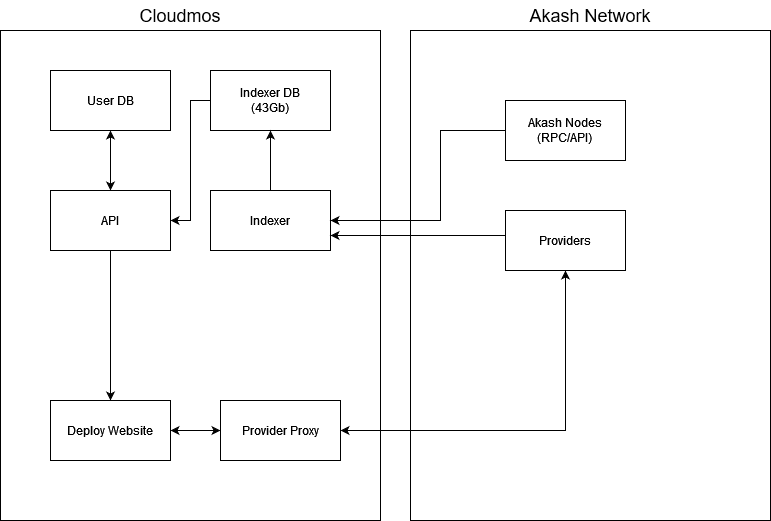

<div align="left">

  <a href="https://aimeos.org/">
    
  </a>

  # Akash Console

[English](README.md) | [简体中文](README.zh-CN.md)

**Akash Console** 是一个功能强大的应用，只需点击几下，即可在 [Akash Network](https://akash.network) 上部署任意 [Docker 容器](https://www.docker.com/)。🚀

如需深入了解代码，请参阅 [](https://deepwiki.com/akash-network/console)

[](https://github.com/akash-network/console/releases)
[](https://github.com/akash-network/console/stargazers)
[](https://github.com/akash-network/console/forks)
[](https://github.com/akash-network/console/blob/main/LICENSE)
[](https://x.com/akashnet)
[](https://discord.gg/akash)

</div>

## 目录

- [快速开始](#快速开始)
- [应用配置](./doc/apps-configuration.md)
- [身份认证](./doc/auth.md)
- [服务](#服务)
- [运行应用](#运行应用)
- [手动数据库恢复](#手动数据库恢复)
- [数据库结构](./doc/database-structure.md)
- [发布工作流](./doc/release-workflow.md)
- [贡献](#贡献)
- [许可证](#许可证)

## 快速开始

要开始使用 Akash Console，请按照以下步骤操作：

```bash
git clone git@github.com:akash-network/console.git ./akash-console
cd akash-console && npm install
cp -n apps/deploy-web/.env.local.sample apps/deploy-web/.env.local
cp -n apps/api/env/.env.local.sample apps/api/env/.env.local
npm run dc:up:dev -- deploy-web
```

这会以开发模式启动 deploy-web 服务，并包含所有必要依赖项（API、indexer、PostgreSQL）。默认情况下，它还会导入 sandbox 数据库备份，以加快流程。

## 应用

所有服务都是使用 TypeScript 编写并通过 Docker 部署的 Node.js 应用。两个数据库均为 PostgreSQL。

- [Console](./apps/deploy-web/)：用于在 Akash 上部署的主网站，基于 Next.js 框架构建。数据来自我们的 API 和 Akash 节点（REST）的组合。
  - [console.akash.network](https://console.akash.network)
- [Stats](./apps/stats/)：基于 Next.js 构建的统计网站，用于展示来自 Indexer 数据库的 Akash Network 使用数据。
  - [stats.akash.network](https://stats.akash.network)
- [Api](./apps/api/)：为 deploy 网站提供数据，并从我们的 Indexer 数据库获取数据。
  - [console-api.akash.network](https://console-api.akash.network/v1/swagger)
- [Indexer](./apps/indexer/)：从 RPC 节点获取最新区块，并将区块和统计信息保存到我们的 Indexer Database。有关 indexer 工作方式的详细信息，请参阅 [Indexer README](./indexer/README.md)。
- [Provider Proxy](./apps/provider-proxy/)：在 deploy 网站中用于代理发往 providers 的请求。这是必要的，因为无法从浏览器使用证书认证系统。

## 托管钱包 API

- 请参阅 [wiki](https://github.com/akash-network/console/wiki/Managed-wallet-API)，使用 Akash Console API 管理部署。

## 运行应用

本文档提供了如何设置和运行应用的说明，包括手动数据库恢复步骤，以及使用 Docker Compose 简化设置。

### 使用 Docker 和 Docker Compose

本项目的服务使用 Docker 和 Docker Compose 部署。以下章节提供了使用 Docker Compose 设置和运行应用的说明。
所有 Dockerfile 都使用 multi-stage builds 来优化镜像构建流程。同一批文件同时用于构建开发镜像和生产镜像。

共有 3 个 docker-compose 文件：

- **docker-compose.build.yml：** 仅用于为服务构建生产镜像的基础文件。它可用于验证与 CICD 相同的构建流程。
- **docker-compose.prod.yml：** 此文件用于以生产模式运行服务。它还包含数据库服务，该服务会获取远程备份并在初始化时导入。
- **docker-compose.yml：** 默认文件，用于以开发模式运行所有服务，并提供 hot-reload 等功能。

为方便使用，package.json 中添加了一些命令。

```shell
npm run dc:build # Build the production images
npm run dc:up:dev # Run the services in development mode
npm run dc:down # Stop the services referencing any possible service
```

注意：你可以将任何 `docker compose` 相关参数传递给上述命令。例如，仅以开发模式启动 `deploy-web` 服务：

```shell
npm run dc:up:dev -- deploy-web
```

这也会正确启动所有依赖项，例如 `api`。

### 使用 Turbo Repo

另一种以 dev mode 运行应用的方式是使用 turbo repo setup。可用命令包括：

```shell
npm run console:dev # run console ui in dev mode with dependencies
npm run stats:dev # run stats ui in dev mode with dependencies
npm run api:dev # run api in dev mode with dependencies
npm run indexer:dev # run indexer in dev mode with dependencies
```

请注意，上述命令仍依赖 docker 来运行 postgres database。如果你需要在不使用 db 的情况下运行它们，可以使用以下命令：

```shell
npm run console:dev:no-db # run console ui in dev mode with dependencies but without postgres in docker
npm run stats:dev:no-db # run stats ui in dev mode with dependencies but without postgres in docker
```

## 手动数据库恢复

由于从 block #1 开始索引 Akash 需要大量时间，建议使用现有备份初始化数据库以提高效率。这种方法对开发场景尤其有用。

### 可用备份

- **Mainnet Database (~30 GB)：** [console-akash-mainnet.sql.gz](https://storage.googleapis.com/console-postgresql-backups/console-akash-mainnet.sql.gz)
  - 适用于需要完整数据的场景。
- **Sandbox Database (< 300 MB)：** [console-akash-sandbox.sql.gz](https://storage.googleapis.com/console-postgresql-backups/console-akash-sandbox.sql.gz)
  - 适合大多数开发需求，但可能缺少最近的链上更新。

### 恢复步骤

1. 创建 PostgreSQL 数据库。
2. 使用 `psql` 恢复数据库。请确保你的系统已安装 PostgreSQL 工具。

对于 .sql.gz 文件：

```sh
gunzip -c /path/to/console-akash-sandbox.sql.gz | psql --host "localhost" --port "5432" --username "postgres" --dbname "console-akash"
```

恢复数据库后，你可以继续按照具体项目的 README 说明进行后续设置并运行应用。

## 服务

本项目采用 monorepo 结构，使我们能够在单个仓库中管理多个相关应用和共享包。



## 共享包

我们使用 `/packages` 文件夹来定义可在应用之间共享的可复用包。这种方式促进了代码复用、可维护性以及各服务之间的一致性。共享包的一些示例包括：

- 通用工具
- 共享类型和接口
- 可复用 UI 组件
- 共享配置文件

通过结合 shared packages 使用这种 monorepo 结构，我们可以高效管理依赖项，简化开发工作流，并确保各个应用之间保持一致。

如需了解如何使用或贡献 shared packages 的更多信息，请参阅 `/packages` 目录中各个 package 内的代码。

## 贡献

如果你想为 Akash Console 的开发做出贡献，请参阅 [CONTRIBUTING.md](./CONTRIBUTING.md) 文件中列出的指南。

## 许可证

本项目基于 [Apache License 2.0](./LICENSE) 授权。
