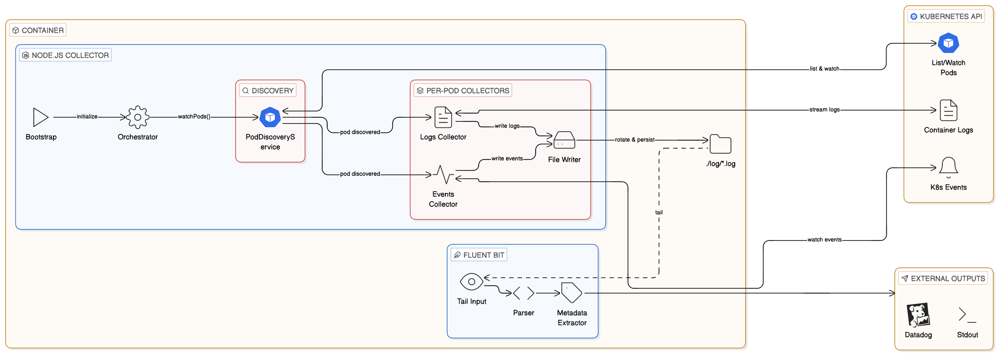

# Architecture

## Overview

The collector runs as a single container alongside Fluent Bit. It discovers pods, collects their container logs and K8s events, and writes everything to per-pod files. Fluent Bit tails those files and forwards to external services like Datadog.

## Components

**K8sCollectorService** — orchestrator. Discovers pods and starts collection for each one.

**PodDiscoveryService** — watches for pod additions and deletions in the namespace. Uses K8s Watch API with automatic fallback to polling if watch is unavailable.

**PodLogsCollectorService** — streams container stdout/stderr for a single pod.

**K8sEventsCollectorService** — watches K8s events (scheduling, image pulls, container lifecycle, OOM kills, etc.) for a single pod. Events are written as JSON lines.

**FileDestinationService** — manages a per-pod log file (`<namespace>_<podName>.log`) with automatic rotation. Shared between log and event collectors for the same pod.

**Fluent Bit** — tails log files, extracts metadata from filenames, and forwards to configured outputs.

## Flows

**Pod discovered:** Both log streaming and event watching start in parallel, writing to the same file.

**Pod deleted:** Both collectors stop gracefully via AbortSignal.

**Events watch forbidden (403):** Event collection is skipped for that pod. Log collection continues.

**Collection error:** The process exits and K8s restarts it.
