# Example Queries

- [Daily New Leases (Last 30 Days)](#daily-new-leases-last-30-days)
- [Daily New Leases **using Persistent Storage** (Last 30 Days)](#daily-new-leases-using-persistent-storage-last-30-days)
- [Daily New Users (Last 30 Days)](#daily-new-users-last-30-days)
- [Top 10 providers with the most active leases](#top-10-providers-with-the-most-active-leases)
- [Top 10 wallets with the most leases (All-Time)](#top-10-wallets-with-the-most-leases-all-time)
- [Top 10 wallets with the most **active leases**](#top-10-wallets-with-the-most-active-leases)
- [Leases that are overdrawn, but not closed yet](#leases-that-are-overdrawn-but-not-closed-yet)
- [Providers per Country](#providers-per-country)
- [Top 10 providers with the most CPU](#top-10-providers-with-the-most-cpu)
- [Network Capacity (CPU) over time (Last 30 Days)](#network-capacity-cpu-over-time-last-30-days)
- [Top 10 largest AKT transfers in the last 7 days](#top-10-largest-akt-transfers-in-the-last-7-days)
- [Get all messages related to a deployment](#get-all-messages-related-to-a-deployment)

## Daily New Leases (Last 30 Days)

```
SELECT "day"."date", COUNT(*)
FROM "lease"
INNER JOIN "block" ON "block"."height" = "lease"."createdHeight"
INNER JOIN "day" ON "day"."id" = "block"."dayId"
GROUP BY "day"."date"
ORDER BY "day"."date" DESC
LIMIT 30
```
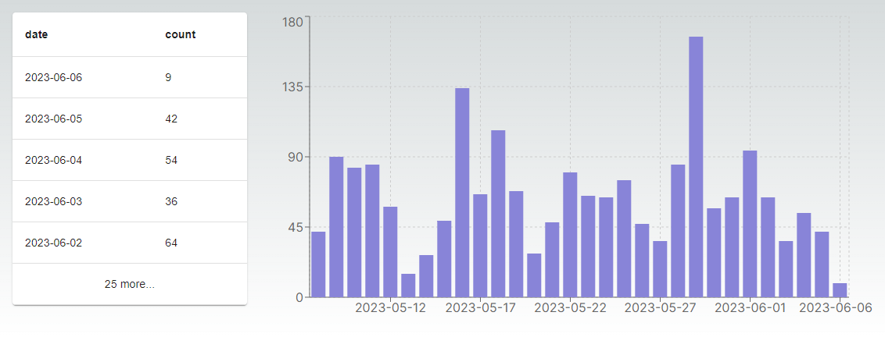

## Daily New Leases **using Persistent Storage** (Last 30 Days)

```
SELECT "day"."date", COUNT("lease"."id")
FROM "lease"
INNER JOIN "block" ON "block"."height" = "lease"."createdHeight"
INNER JOIN "day" ON "day"."id" = "block"."dayId"
WHERE "lease"."persistentStorageQuantity" > 0
GROUP BY "day"."date"
ORDER BY "day"."date" DESC
LIMIT 30
```


## Daily New Users (Last 30 Days)

```
WITH "Addresses" AS (
    SELECT 
        l."owner" AS "Address",
        MIN(b."datetime") AS "FirstDeployDate"
    FROM "lease" l
    INNER JOIN "block" b ON b.height = l."createdHeight"
    GROUP BY l."owner"
)
SELECT
    DATE("FirstDeployDate") AS "Date",
    COUNT(*) AS "New Address Count"
FROM "Addresses" AS d
GROUP BY DATE("FirstDeployDate")
ORDER BY DATE("FirstDeployDate") DESC
LIMIT 30
```
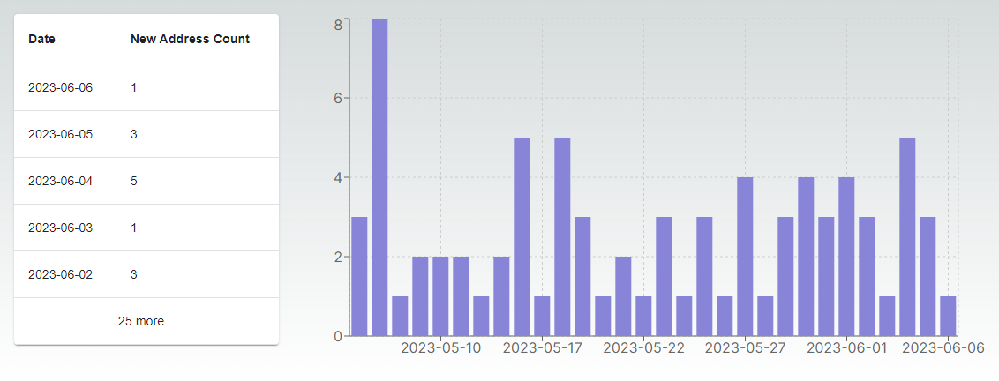

## Top 10 providers with the most active leases

```
SELECT "provider"."owner", "provider"."hostUri", COUNT(*) 
FROM provider
INNER JOIN "lease" ON "lease"."providerAddress" = provider."owner"
WHERE "lease"."closedHeight" IS NULL
GROUP BY "provider"."owner"
ORDER BY COUNT(*) DESC
LIMIT 10
```
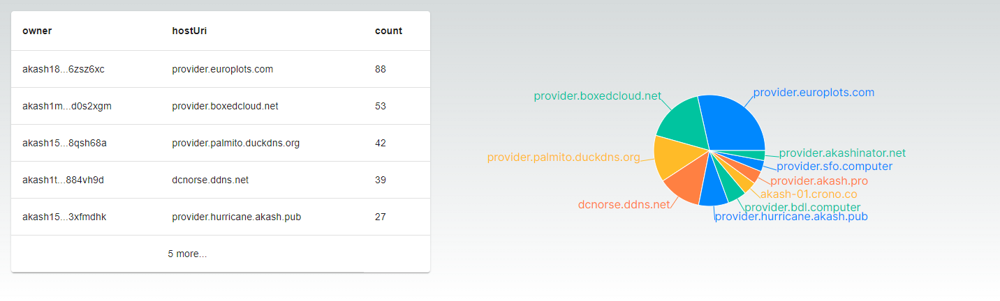

## Top 10 wallets with the most leases (All-Time)

```
SELECT "owner", COUNT(*) 
FROM lease
GROUP BY "lease"."owner"
ORDER BY COUNT(*) DESC
LIMIT 10
```
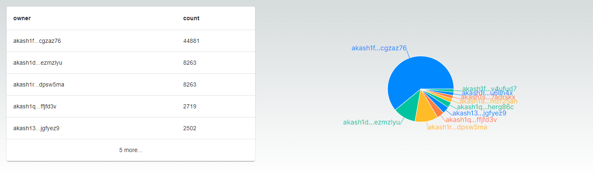

## Top 10 wallets with the most **active leases**

```
SELECT "owner", COUNT(*) 
FROM lease
WHERE "lease"."closedHeight" IS NULL
GROUP BY "lease"."owner"
ORDER BY COUNT(*) DESC
LIMIT 10
```
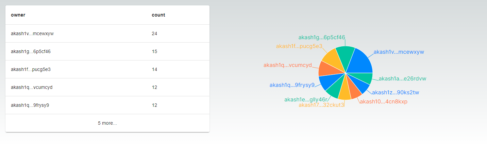

## Leases that are overdrawn, but not closed yet

```
SELECT owner,dseq,"providerAddress"
FROM lease
WHERE "closedHeight" IS NULL AND "predictedClosedHeight" < (SELECT MAX(height) FROM block)
```
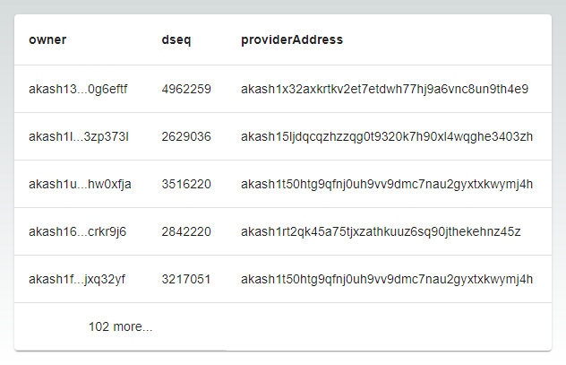

## Providers per Country

```
SELECT "ipCountry", COUNT(*)
FROM provider
WHERE "isOnline" IS TRUE
GROUP BY "ipCountry"
ORDER BY COUNT(*) DESC
```
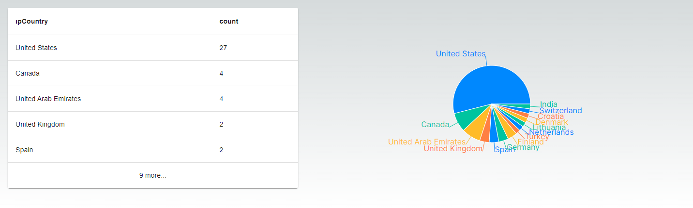

## Top 10 providers with the most CPU

```
SELECT owner,"hostUri", ("activeCPU" + "pendingCPU" + "availableCPU") / 1000 AS "Total CPU"
FROM provider
WHERE "isOnline" IS TRUE
ORDER BY ("activeCPU" + "pendingCPU" + "availableCPU") / 1000 DESC
LIMIT 10
```
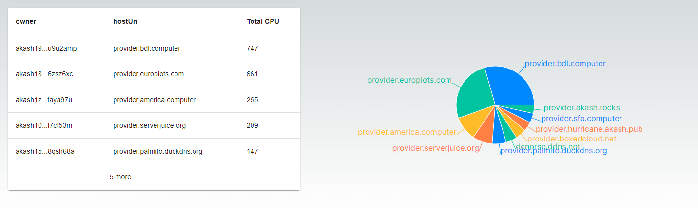

## Network Capacity (CPU) over time (Last 30 Days)

```
WITH daily_last_snapshot AS (
    SELECT owner, date("checkDate") as day, MAX("checkDate") as last_check_date
    FROM public."providerSnapshot"
  WHERE "isOnline" IS TRUE
    GROUP BY owner, day
)
SELECT 
  dls."day" AS "Day", 
  ROUND(SUM(ps."activeCPU"+ps."pendingCPU"+ps."availableCPU") / 1000) AS "Total CPU"
FROM public."providerSnapshot" ps
JOIN daily_last_snapshot dls ON dls.owner = ps.owner AND dls.last_check_date = ps."checkDate"
GROUP BY dls."day"
ORDER BY dls."day" DESC
LIMIT 30
```
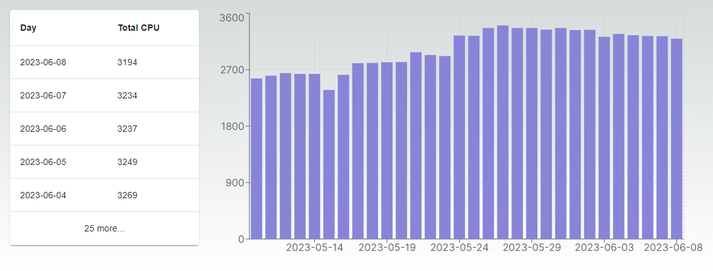

## Top 10 largest AKT transfers in the last 7 days

```
SELECT 
    "message"."height", 
    "transaction"."hash", 
    "amount" / 1000000 AS "AKT Amount", 
    "amount" / 1000000 * "day"."aktPrice" AS "USD Amount"
FROM "message"
INNER JOIN "block" ON "block".height = "message".height
INNER JOIN "transaction" ON "transaction"."id" = "message"."txId"
INNER JOIN "day" ON "day".id = "block"."dayId"
WHERE 
    "block"."datetime" > NOW() + INTERVAL '-7 days'
    AND "day"."aktPrice" IS NOT NULL
    AND "message"."amount" IS NOT NULL
    AND "message"."type" = '/cosmos.bank.v1beta1.MsgSend'
ORDER BY "amount" / 1000000 * "day"."aktPrice" DESC
LIMIT 10
```
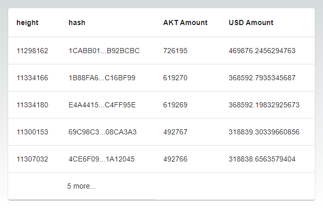

## Get all messages related to a deployment

```
SELECT height,type
FROM "message"
INNER JOIN "deployment" ON "deployment".id = "message"."relatedDeploymentId"
WHERE "owner" = '<AKASH_ADDRESS>' AND "dseq"='<DSEQ>'
ORDER BY "height" DESC
```
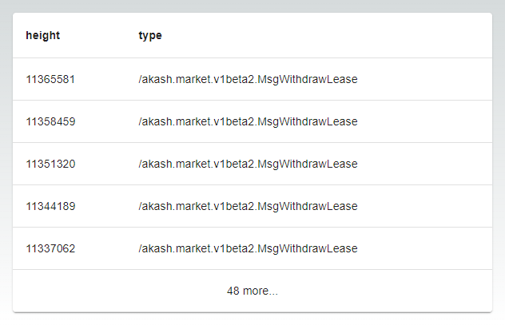

## Get the total amount of total leases, akt spent, usdc spent and usd spent per address sorted by total leases

You can also filter for only gpu leases by adding `WHERE l."gpuUnits" > 0` to the `active_lease` query

```
WITH current_block AS (
    SELECT MAX(height) as height 
    FROM block
),
active_leases AS (
    SELECT 
        l.id,
        l.owner,
        l.denom,
        l.price,
        l."createdHeight",
        LEAST((SELECT height FROM current_block), COALESCE(l."closedHeight" ,l."predictedClosedHeight")) as end_height,
        d."aktPrice"
    FROM lease l
    INNER JOIN block b ON b.height = l."createdHeight"
    INNER JOIN day d ON d.id = b."dayId"
),
lease_costs AS (
    SELECT 
        owner,
        ROUND(CAST(SUM(CASE 
            WHEN denom = 'uakt' 
            THEN (end_height - "createdHeight") * price / 1000000.0
            ELSE 0 
        END) as numeric), 2) as total_akt_spent,
        ROUND(CAST(SUM(CASE 
            WHEN denom = 'uusdc' 
            THEN (end_height - "createdHeight") * price / 1000000.0
            ELSE 0 
        END) as numeric), 2) as total_usdc_spent,
        ROUND(CAST(SUM(CASE 
            WHEN denom = 'uakt' 
            THEN (end_height - "createdHeight") * price * "aktPrice" / 1000000.0
            WHEN denom = 'uusdc' 
            THEN (end_height - "createdHeight") * price / 1000000.0
            ELSE 0 
        END) as numeric), 2) as total_usd_spent
    FROM active_leases
    GROUP BY owner
)
SELECT 
    al.owner,
    COUNT(DISTINCT al.id) as active_lease_count,
    COALESCE(lc.total_akt_spent, 0.00) as total_akt_spent,
    COALESCE(lc.total_usdc_spent, 0.00) as total_usdc_spent,
    COALESCE(lc.total_usd_spent, 0.00) as total_usd_spent
FROM active_leases al
LEFT JOIN lease_costs lc ON lc.owner = al.owner
GROUP BY 
    al.owner,
    lc.total_akt_spent,
    lc.total_usdc_spent,
    lc.total_usd_spent
ORDER BY active_lease_count DESC;
```

## Cross database queries from chain-db (indexer) and user db

User db stores the addresses of the managed wallet users and if we want to query the indexer db to compute amount spent, we need to do a cross database query.

This query will fetch the sum of all spent for all the users per day.

```
-- First, enable postgres_fdw extension in both databases
CREATE EXTENSION postgres_fdw;

-- In the user db database, create the foreign server connection to the chain database
CREATE SERVER chain_db
  FOREIGN DATA WRAPPER postgres_fdw
  OPTIONS (host 'localhost', port '5432', dbname 'console-akash');

-- Create user mapping
CREATE USER MAPPING FOR CURRENT_USER
  SERVER chain_db
  OPTIONS (user 'postgres', password 'your_password');

IMPORT FOREIGN SCHEMA public 
  LIMIT TO (lease, block, day)
  FROM SERVER chain_db 
  INTO public;
  
-- Create foreign tables for the tables we need
CREATE FOREIGN TABLE chain_lease (
    id uuid,
    owner character varying(255),
    denom character varying(255),
    price double precision,
    "createdHeight" integer,
    "closedHeight" integer,
    "predictedClosedHeight" numeric(30,0)
) SERVER chain_db
OPTIONS (schema_name 'public', table_name 'lease');

CREATE FOREIGN TABLE chain_block (
    height integer,
    datetime timestamp with time zone,
    "dayId" uuid
) SERVER chain_db
OPTIONS (schema_name 'public', table_name 'block');

CREATE FOREIGN TABLE chain_day (
    id uuid,
    date timestamp with time zone,
    "aktPrice" double precision,
	"firstBlockHeight" integer,
	"lastBlockHeight" integer,
	"lastBlockHeightYet" integer
) SERVER chain_db
OPTIONS (schema_name 'public', table_name 'day');

-- Query the amount spent per day for all the trial or non-trial users, just change w.trial = true or false
WITH daily_leases AS (
    SELECT 
        d.date, 
        l.id,
        ((LEAST(d."lastBlockHeightYet", COALESCE(l."closedHeight", l."predictedClosedHeight")) - GREATEST(d."firstBlockHeight", l."createdHeight")) * l.price) AS "uusdc_spent"
    FROM chain_day d
    INNER JOIN chain_lease l ON l."createdHeight" < d."lastBlockHeightYet" AND COALESCE(l."closedHeight", l."predictedClosedHeight") > d."firstBlockHeight"
	INNER JOIN user_wallets w ON w.address = l.owner AND w.trial = true
    WHERE l.denom='uusdc' 
)
SELECT 
    date AS "Date",
    COUNT(l.id) AS "Lease Count",
    ROUND(SUM(l.uusdc_spent)::decimal / 1000000, 2) AS "USDC Spent",
    ROUND(SUM(SUM(l.uusdc_spent)::decimal) OVER (ORDER BY date) / 1000000, 2) AS "Cummulative USDC Spent"
FROM daily_leases l
GROUP BY date
ORDER BY date DESC

```

## Query to fetch the daily spent for a wallet address (owner)

```
WITH current_block AS (
    SELECT MAX(height) as height 
    FROM block
),
daily_leases AS (
    SELECT 
        d.date,
        l.owner,
        l.denom,
        l.price,
        l."createdHeight",
        CASE 
            WHEN l.id IS NULL THEN 0
            ELSE LEAST(d."lastBlockHeightYet", COALESCE(l."closedHeight", l."predictedClosedHeight")) - 
                 GREATEST(d."firstBlockHeight", l."createdHeight")
        END as blocks_in_day,
        d."aktPrice"
    FROM day d
    LEFT JOIN lease l ON 
        l.owner = 'akash120y4k8s9zlpwtkdj94n9mdnd7czt0xuu5yrzes' AND -- change the owner here
        l."createdHeight" < d."lastBlockHeightYet" AND 
        COALESCE(l."closedHeight", l."predictedClosedHeight") > d."firstBlockHeight"
),
daily_costs AS (
    SELECT 
        date,
        ROUND(CAST(SUM(CASE 
            WHEN denom = 'uakt' 
            THEN blocks_in_day * price / 1000000.0
            ELSE 0 
        END) as numeric), 2) as daily_akt_spent,
        ROUND(CAST(SUM(CASE 
            WHEN denom = 'uusdc' 
            THEN blocks_in_day * price / 1000000.0
            ELSE 0 
        END) as numeric), 2) as daily_usdc_spent,
        ROUND(CAST(SUM(CASE 
            WHEN denom = 'uakt' 
            THEN blocks_in_day * price * "aktPrice" / 1000000.0
            WHEN denom = 'uusdc' 
            THEN blocks_in_day * price / 1000000.0
            ELSE 0 
        END) as numeric), 2) as daily_usd_spent
    FROM daily_leases
    GROUP BY date
)
SELECT 
    d.date::DATE AS "Date",
    COUNT(dl.owner) AS "Active Leases",
    COALESCE(dc.daily_akt_spent, 0) as "Daily AKT Spent",
    COALESCE(SUM(dc.daily_akt_spent) OVER (ORDER BY d.date), 0) as "Total AKT Spent",
    COALESCE(dc.daily_usdc_spent, 0) as "Daily USDC Spent",
    COALESCE(SUM(dc.daily_usdc_spent) OVER (ORDER BY d.date), 0) as "Total USDC Spent",
    COALESCE(dc.daily_usd_spent, 0) as "Daily USD Spent",
    COALESCE(SUM(dc.daily_usd_spent) OVER (ORDER BY d.date), 0) as "Total USD Spent"
FROM day d
LEFT JOIN daily_leases dl ON dl.date = d.date
LEFT JOIN daily_costs dc ON dc.date = d.date
GROUP BY 
    d.date,
    dc.daily_akt_spent,
    dc.daily_usdc_spent,
    dc.daily_usd_spent
ORDER BY d.date DESC;
```