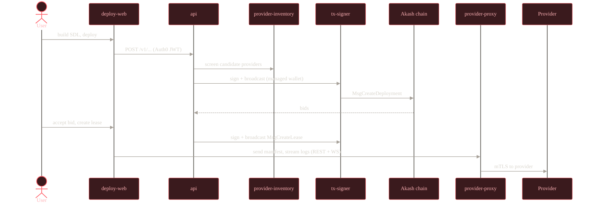
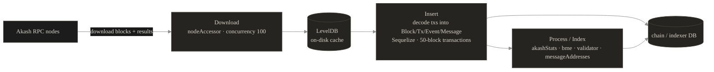
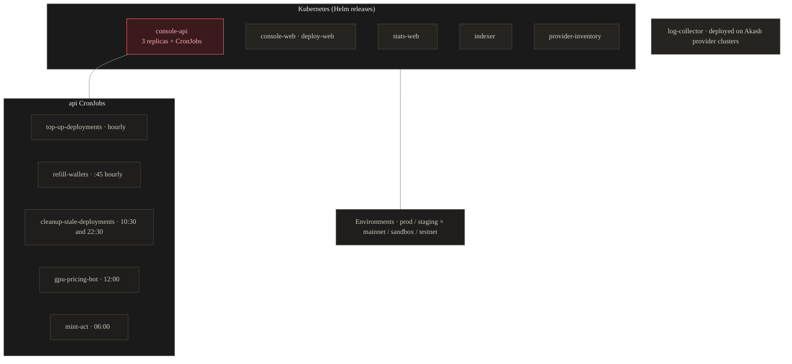

# Architecture

This document describes the architecture of the Akash Console monorepo: its applications, data stores, external integrations, and how everything is deployed. For a high-level overview and the main system diagram, see the [README](../README.md#architecture).

## Overview

Akash Console is a monorepo managed with npm workspaces. It powers the managed Console at [console.akash.network](https://console.akash.network), where users deploy Docker workloads on the [Akash Network](https://akash.network) using a managed wallet. The self-custody variant (Keplr / Leap / your own wallet) lives in a separate repository, [Akash Console Air](https://github.com/akash-network/console-air).

The system is split into three frontends, six backend services, and a set of shared packages. Backend Node services use [tsyringe](https://github.com/microsoft/tsyringe) for dependency injection, except `notifications` (NestJS modules) and `indexer` (plain procedural code). Frontends are Next.js. All services are written in strict TypeScript and shipped as Docker images.

## Components

### Frontends (Next.js)

- **deploy-web** ([`apps/deploy-web`](../apps/deploy-web)) - the flagship Console UI for building SDLs, deploying, and managing deployments. Talks to `api` over REST and to `provider-proxy` over REST + WebSocket (for manifest send, log/shell/event streaming). Serves [console.akash.network](https://console.akash.network). No direct database access.
- **stats-web** ([`apps/stats-web`](../apps/stats-web)) - the public network-statistics site, [stats.akash.network](https://stats.akash.network). Renders charts of network usage, providers, leases, and market data, all fetched from `api`.
- **provider-console** ([`apps/provider-console`](../apps/provider-console)) - a wizard UI for creating and managing an Akash provider, [provider-console.akash.network](https://provider-console.akash.network). Its primary backend is a separate Go service (`provider-console-api` / `provider-console-security`) that lives outside this monorepo; it calls the Console `api` only secondarily.

### Backend services

- **api** ([`apps/api`](../apps/api)) - the central REST/OpenAPI backend behind [console-api.akash.network](https://console-api.akash.network/v1/swagger). Built with Hono + `@hono/zod-openapi` + tsyringe. It serves deployments, billing, certificates, dashboard/stats aggregation, templates, providers, bid-screening proxy, notifications proxy, and confidential-compute attestation. It forks worker-thread "interfaces": `rest` (HTTP, port 3080) and `background-jobs` (pg-boss queue + cron, port 3081). It is the only service that spans both databases: it reads the chain DB (Sequelize) and reads/writes the user DB (Drizzle + pg-boss).
- **indexer** ([`apps/indexer`](../apps/indexer)) - downloads Akash chain blocks and indexes them into the chain DB. Plain Node + Express (status endpoint on port 3079) driven by a custom scheduler. See [Indexer pipeline](#indexer-pipeline) below.
- **notifications** ([`apps/notifications`](../apps/notifications)) - a NestJS service that listens to chain events, evaluates alerts, and sends email via Novu. Uses pg-boss as its message broker. The runtime interface is selected via the `INTERFACE` env var (`rest`, `chain-events`, `alert-events`, `notifications-events`, or `all`). Reached through `api`, which proxies `/notifications` routes to it.
- **provider-proxy** ([`apps/provider-proxy`](../apps/provider-proxy)) - bridges browser requests to Akash providers, which speak mTLS and cannot be reached directly from a browser. Hono + a bare `ws` WebSocket server on port 3040. Also validates certificates against a chain REST node. Serves [console-provider-proxy.akash.network](https://console-provider-proxy.akash.network).
- **provider-inventory** ([`apps/provider-inventory`](../apps/provider-inventory)) - the bid-screening service. It keeps a live table of each provider's cluster capacity and pre-filters providers that could satisfy a deployment's GroupSpec. Hono + tsyringe + Drizzle. It forks two worker-thread interfaces: `rest` (port 3092, exposes `/v1/bid-screening`) and `providers-sync` (port 3093, the streamer/discovery scheduler that opens long-lived gRPC `streamStatus` connections to providers). Reached only through `api`. See [`apps/provider-inventory/CONTEXT.md`](../apps/provider-inventory/CONTEXT.md) for the full domain model.
- **tx-signer** ([`apps/tx-signer`](../apps/tx-signer)) - an internal service that signs and broadcasts Akash transactions with the funding wallet or a derived wallet (the managed-wallet flow). Hono + tsyringe. Endpoints: `POST /v1/tx/funding`, `POST /v1/tx/derived`. Called by `api`; no database.

### Supporting tool

- **log-collector** ([`apps/log-collector`](../apps/log-collector)) - collects container logs and Kubernetes events from all pods in a namespace and forwards them to Datadog via Fluent Bit. Deployed onto Akash provider clusters rather than as part of the Console platform. Image: `ghcr.io/akash-network/log-collector`.

## Data stores

All databases are PostgreSQL. In development they run as five logical databases on a single Postgres instance (seeded from the `POSTGRES_DBS` list in `packages/docker/.env.sandbox.docker-compose-dev`); in production they are split across managed instances.

| Database | Owner (writes) | Read by | ORM |
|---|---|---|---|
| `console-users` | api | api | Drizzle (also hosts the `pgboss` job-queue schema) |
| `console-akash-sandbox` (chain / indexer DB) | indexer | api, and stats-web via api | Sequelize |
| `notification_service` | notifications | notifications | Drizzle |
| `events` | notifications | notifications | pg-boss (message broker) |
| `provider_inventory` | provider-inventory | provider-inventory | Drizzle |

Notes:

- **Two ORMs coexist in `api`**: Sequelize for reading the chain DB, Drizzle for the user DB. Shared chain schemas live in [`packages/database`](../packages/database) and are consumed by the indexer.
- **No Redis / BullMQ / RabbitMQ.** Both the `api` background-job queue and the `notifications` broker are backed by [pg-boss](https://github.com/timgit/pg-boss) (Postgres).
- The **indexer** also keeps an on-disk **LevelDB** cache for raw block JSON during syncing.

For table-level detail, see [database-structure.md](./database-structure.md).

## Data flow

A typical managed-wallet deployment flows through the platform like this:

Billing runs alongside this flow through Stripe (handled in `api`), and deployment lifecycle events are picked up by `notifications`, which emails users via Novu.

## Indexer pipeline

The indexer is scheduler-driven. Its core "Sync Blocks" task runs every 7 seconds as a three-stage pipeline, alongside periodic tasks (sync providers, price history, provider uptime, IP lookup, keybase info):

1. **Download** - `downloadBlocks()` fetches blocks and block-results from RPC nodes (concurrency 100, batched to 1,000 blocks per pass), caching raw JSON in LevelDB.
2. **Insert** - `insertBlocks()` decodes transactions with cosmjs, builds Block / Transaction / TransactionEvent / Message rows plus raw BME events, and bulk-inserts in Sequelize transactions of 50 blocks.
3. **Process / Index** - `statsProcessor.processMessages()` runs the registered indexers (`akashStatsIndexer`, `bmeIndexer`, `validatorIndexer`, `messageAddressesIndexer`) to derive deployments, leases, bids, provider snapshots, and the BME ledger. The LevelDB cache is then cleared unless `KEEP_CACHE` is set.

## External integrations

| System | Used by | Purpose |
|---|---|---|
| Akash chain nodes (RPC / REST) | indexer, api, notifications, tx-signer | Block download, chain reads, tx broadcast, event listening |
| Akash providers | provider-proxy, provider-inventory | mTLS REST/WS bridge; gRPC `streamStatus` for capacity |
| Auth0 | api, deploy-web | Authentication (M2M + user JWT); dev uses a mock OAuth server |
| Stripe | api, deploy-web | Payments / billing and webhooks |
| Novu | notifications | Email delivery |
| Amplitude | api, notifications, deploy-web | Product analytics |
| Google Analytics / GTM | deploy-web | Web analytics |
| Unleash | api, deploy-web, stats-web | Feature flags |
| Cloudflare Turnstile | deploy-web | Bot protection |
| GCP Cloud Storage | DB seeding, api | Database backups and template logos |
| GitHub / GitLab / Bitbucket | deploy-web, api | Repository import for CI-based deploys |
| Sentry | most apps | Error tracking |
| OpenTelemetry | all Node apps (via `packages/instrumentation`) | Traces and metrics |
| Fluentd / Datadog | api, log-collector | Log forwarding |
| CoinGecko / Keybase / IP geolocation | indexer | Price history, validator info, provider location |
| Confidential-compute attestation (Intel / AMD / NVIDIA) | api | TEE / confidential-compute attestation |

## Deployment topology

Apps are deployed to Kubernetes via Helm, with one values file per environment in [`.helm/`](../.helm). Environments are matrixed across prod / staging by mainnet / sandbox / testnet.

The `api` release also runs scheduled CronJobs (defined inline in its values file), each invoking `dist/console.js <command>`. Not every service has its own Helm values file in this repo: `tx-signer`, `notifications`, `provider-proxy`, and `provider-console` are deployed through other pipelines, and `log-collector` runs on provider clusters. `provider-console`'s primary backend is a separate Go repository.
